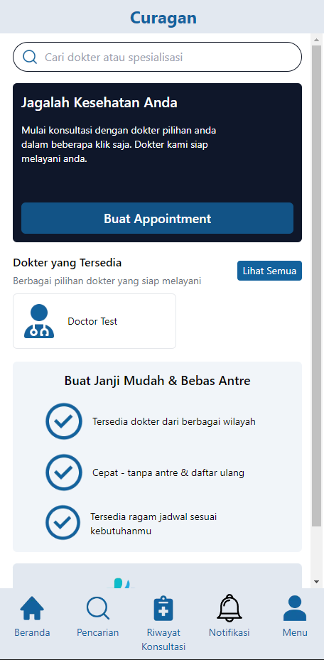
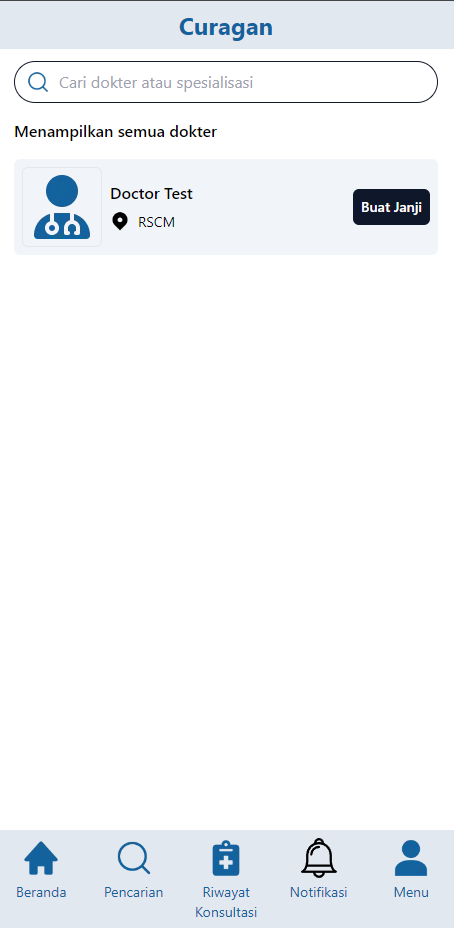
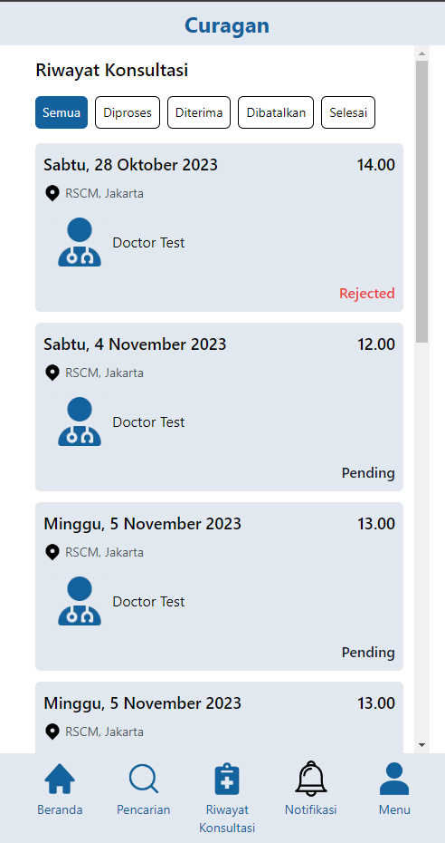
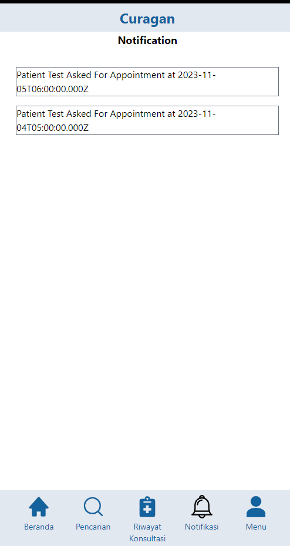
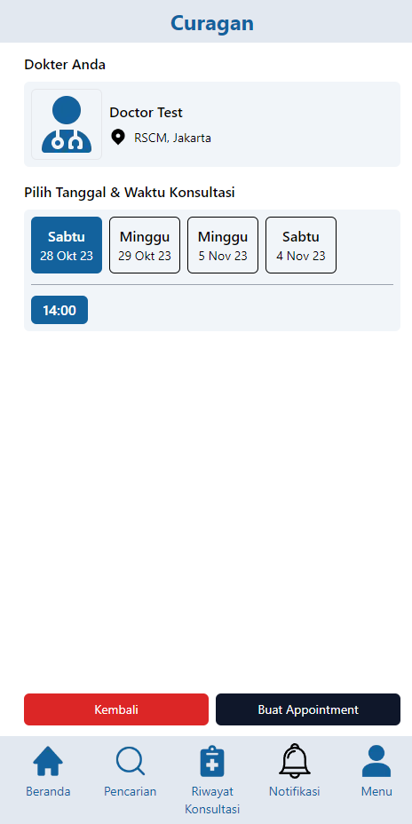
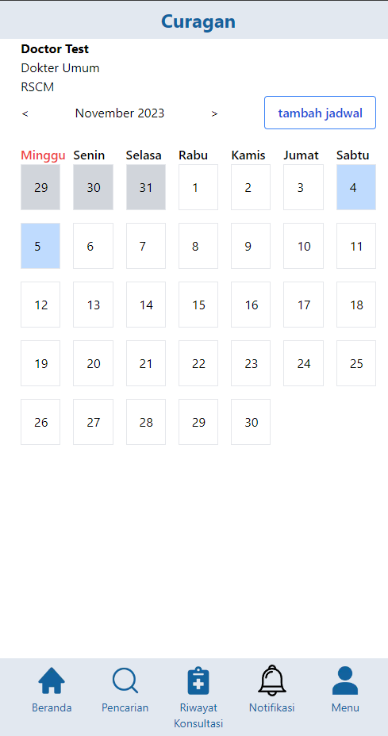

# CURAGAN

Curagan is a mobile-based web application where we can make appointments with available doctors for consultation.

## Installation

### Client Side

1. Pull this repository

2. Install Dependencies

```bash
npm install
```

or

```bash
yarn install
```

3. Run the service

```bash
npm run dev
```

<mark> Doctor's Account can only created using a request to admin</mark>

### Server Side

1. Pull this repository: https://github.com/yankyhermawan/curagan-personal.git

2. Install Dependencies

```bash
npm install
```

or

```bash
yarn install
```

3. Run the service

```bash
npm run dev
```

<mark>Create .env by your own</mark>

## Preview

Beranda



Pencarian



Riwayat



Notifikasi



Jadwal Dokter



Atur Jadwal Dokter



Known Issues:

- NextJS Router can't define the id parameter in some routes
- It will error if you try to refresh the page (even though the first visit has no error)
